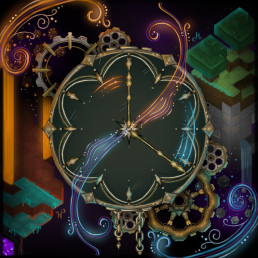

# Chronos Backup



[](https://modrinth.com/mod/chronos-backup) [](https://www.curseforge.com/minecraft/mc-mods/chronos-backup)

**Chronos Backup** is a multi-loader Minecraft backup utility. Designed to save the most important parts of your world, keeping backups smaller.

The project is organized as a small, version-agnostic **core** (scheduler + backup runner) plus loader/version-specific **shells**, with one central place to edit mod metadata.

## Features

- Multi-version, multi-loader architecture (Fabric, NeoForge, Forge).
- Focused backups that include critical world files instead of copying everything.
- Shared core logic with generated loader/version variants for broad compatibility.

## Architecture

Chronos Backup is made of two layers:

- **Shell layer**: loader and version specific integration code that hooks into the server/runtime and exposes configuration per platform.
- **Core layer**: loader-agnostic scheduling and backup execution logic reused across all targets.

## Supported and moddable targets

All currently supported versions are listed below in `major.minor.x` format:

| Minecraft | Support | Loader(s) | Backup | Config | Notes |
| - | - | - | - | - | - |
| `26.1.x` | ✅ Supported | Fabric + NeoForge | ✅ | 🔴 None | - |
| `1.21.x` | ✅ Supported | Fabric + NeoForge | ✅ | 🔴 None | - |
| `1.20.x` | ✅ Supported | Fabric + NeoForge | ✅ | 🔴 None | 1.20.0 Fabric only, Forge support coming soon. NeoForge and Fabric for 1.20.1-1.20.6 |
| `1.19.x` | ❌ Unsupported | Forge / Fabric | ❌ | 🔴 None | - |
| `1.18.x` | ❌ Unsupported | Forge / Fabric | ❌ | 🔴 None | - |
| `1.17.x` | ❌ Unsupported | Forge / Fabric | ❌ | 🔴 None | - |
| `1.16.x` | ❌ Unsupported | Forge / Fabric | ❌ | 🔴 None | - |
| `1.15.x` | ❌ Unsupported | Forge / Fabric | ❌ | 🔴 None | - |
| `1.14.x` | ❌ Unsupported | Forge / Fabric | ❌ | 🔴 None | - |
| `1.13.x` | ❌ Unsupported | Forge | ❌ | 🔴 None | - |
| `1.12.x` | ✅ Supported | Forge | ✅ | 🔴 None | - |
| `1.11.x` | ❌ Unsupported | Forge | ❌ | 🔴 None | - |
| `1.10.x` | ❌ Unsupported | Forge | ❌ | 🔴 None | - |
| `1.9.x` | ❌ Unsupported | Forge | ❌ | 🔴 None | - |
| `1.8.x` | ❌ Unsupported | Forge | ❌ | 🔴 None | - |
| `1.7.x` | ❌ Unsupported | Legacy Forge | ❌ | 🔴 None | - |
| `1.6.x` | ❌ Unsupported | Legacy Forge | ❌ | 🔴 None | - |
| `1.5.x` | ❌ Unsupported | Legacy Forge | ❌ | 🔴 None | - |
| `1.4.x` | ❌ Unsupported | Legacy Forge | ❌ | 🔴 None | - |
| `1.3.x` | ❌ Unsupported | Legacy Forge | ❌ | 🔴 None | - |
| `1.2.x` | ❌ Unsupported | Legacy Forge | ❌ | 🔴 None | - |
| `1.1.x` | ❌ Unsupported | Legacy Forge | ❌ | 🔴 None | - |

For **1.20.x**, Minecraft **1.20** and **1.20.1** are **Fabric-only**; **Forge** for those versions is not shipped yet but is planned.

## Development

### Prerequisites

- Install **JDK 25+** and set `JAVA_HOME` to it.
- Older variants use a Java 8, 17 or 21 toolchain via Gradle/Foojay automatically.

### Commands

Use the Gradle wrapper from the repo root.

#### PowerShell

```powershell
.\gradlew.bat buildAll
.\gradlew.bat smokeTestServers
.\gradlew.bat smokeTestServers -PchronosSmokeArgs="--workers 16"
```

Bash/zsh:

```bash
./gradlew buildAll
./gradlew smokeTestServers
```

### Most useful tasks

- `buildAll` - builds all enabled variants (Fabric, NeoForge, Forge), then collects output jars.
- `collectAllJars` - copies final jars to root `build/libs/`. Automatically run by `buildAll`.
- `:fabric-line-1_21:build`, `:neoforge-line-1_21:build`, `:neoforge-1_21_4:build` - build one target.
- `:<version>-line-<compileGroup>:runClient` - Runs the client for the given version and compile group.
- `:<version>-line-<compileGroup>:runServer` - Runs the server for the given version and compile group. (will not automatically shut down like `smokeTestServers` does)
- `generateVariantProjects` - generates variant projects from `gradle/chronos-versions.json` and `gradle/chronos-compile-groups.json`. Should be run automaticaly.
- `smokeTestServers` - runs dev servers and checks expected Chronos startup lines. Arguments: `--workers <number>` (default 4), `--only <label>` (repeatable).

Example Smoke Test command:

```powershell
.\gradlew.bat smokeTestServers -PchronosSmokeArgs="--workers 2 --only fabric-line-1_21"
```

Example Run command:

```powershell
.\gradlew.bat :fabric-line-26_1:runClient
.\gradlew.bat :neoforge-line-1_21:runServer
```
